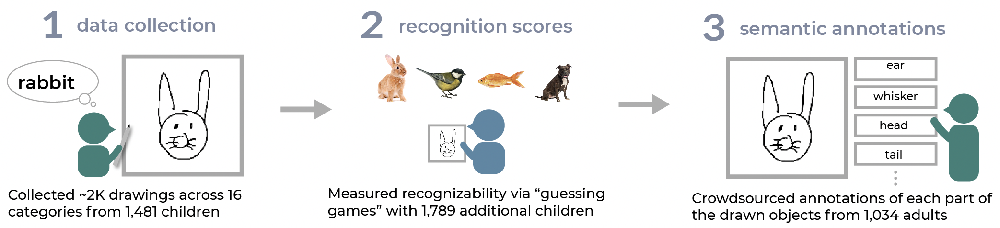
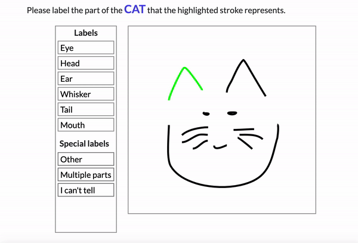
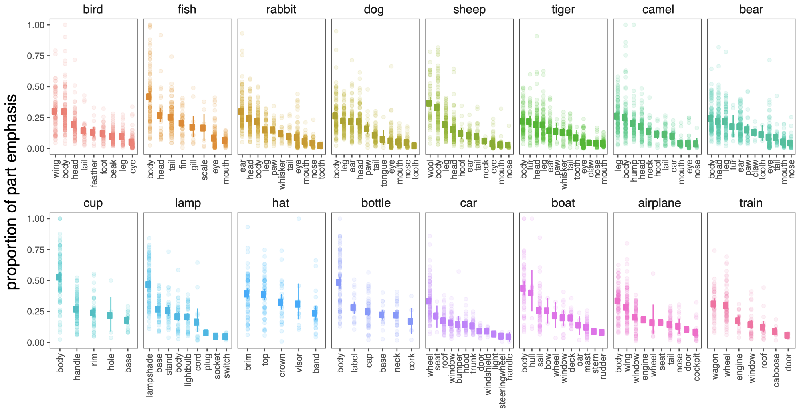
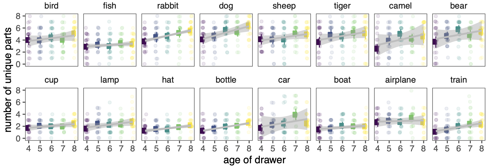
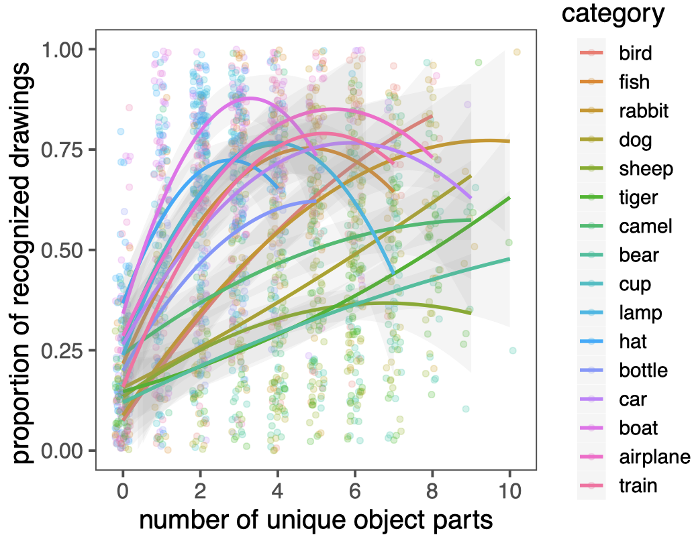

# Developmental changes in the semantic part structure of drawn objects
#### Holly Huey, Bria Long, Justin Yang, Kaylee George, & Judith E. Fan

Children produce increasingly more recognizable drawings of object concepts throughout childhood. 
What drives this improvement? Here we explore the role of children’s ability to include relevant parts of those objects in their drawings.

  </img>

### Developmental drawing dataset

We first obtained line drawings of common object categories previously collected by Long, B., Fan, J., Chai, R., & Frank, M. C. (2021)., in which young children played a drawing game on a freestanding kiosk of a local children’s museum.
These categories included a variety of animals and inanimate objects, and were chosen from categories that are often drawn by children (e.g., dog, cup) and also less frequently drawn (e.g., camel, lamp).

From the larger dataset, we randomly selected 2,160 drawings of 16 categories that were produced by 4 to 8-year-old children (N=1481 children), including 560 drawings of small animals (rabbit, dog, fish, bird); 600 drawings of large animals (camel, tiger, sheep, bear); 500 drawings of vehicles (airplane, boat, car, train); and 500 drawings of small household objects (bottle, lamp, hat, cup). 
We chose these drawings to annotate, because this subset was additionally used to test a different set of children’s recognition of the drawn objects (see below).

### Drawing recognizability

The original dataset also included recognizability scores for each drawing, generated by a separate set of children (N=1,789 children, aged 3-10 years, M age = 5.49 years). 
These recognizability scores were generated from four different “guessing games” for each broad object category (small animals, large animals, vehicles, household objects). 
Children were presented with a drawing on the same museum kiosk, and asked to guess which of four object categories each drawing represented (Long et al., 2021).
Children indicated their guess using touchscreen buttons with canonical photographs of each possible category. All distractors were from the same broad category (e.g., vehicles).

<i>See this repo for more information: https://github.com/brialorelle/kiddraw</i>

### Crowdsourcing semantic annotations of the dataset

  </img>

We crowdsourced part tags for every pen stroke in 2,160 drawings of 16 common object categories that had been produced by children between 4 and 8 years old. 

## Results
#### Which parts of objects did children prioritize in their drawings? 

  </img>

Overall, children prioritized certain parts of object categories over others, by both including more object parts and devoting a greater amount of strokes to them. 

#### Do older children draw more object parts?

  </img>

These part decompositions also revealed both substantial variation in the number of parts that children emphasized across development. 

#### Do more recognizable drawings contain more object parts?

  </img>

To test how variability in the number of drawn object parts may predict how well naive viewers can recognize the depicted objects, we leveraged the recognition scores previously generated by a second set of children in Long et al. (2021).
We found that drawings with both too few and too many object parts tended to be less recognizable to children, relative to drawings with an intermediate number of unique parts. 
We additionally observed wide item variability both between and within broad object categories (i.e., small animals, large animals, vehicles, household objects), in which some categories tended to have more variation in the number of depicted parts and variation in the relative strength of a quadratic relationship to their recognizability.
This variability in recognizability suggests that as children gain more semantic knowledge object categories, they may need to adjust how many parts of object they should choose to include in their drawings in order to produce more recognizable drawings.

## How to navigate this repository

See `/experiments/` for our web experiment for collecting the semantic annotations. This experiment was built using JsPsych: https://www.jspsych.org/7.2/
